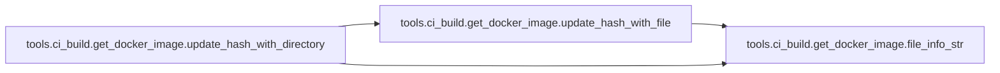
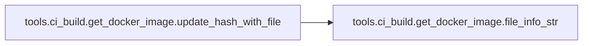
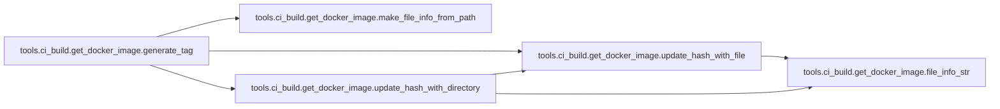
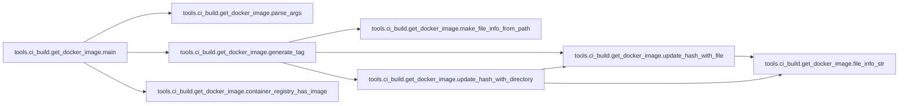
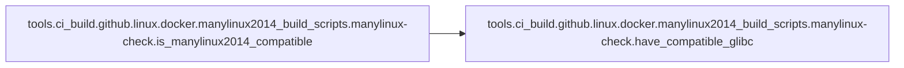

# Tools Ci Build

[_Documentation generated by Documatic_](https://www.documatic.com)

<!---Documatic-section-Codebase Structure-start--->
## Codebase Structure

<!---Documatic-block-system_architecture-start--->
```mermaid
None
```
<!---Documatic-block-system_architecture-end--->

# #
<!---Documatic-section-Codebase Structure-end--->

<!---Documatic-section-tools.ci_build.get_docker_image.parse_args-start--->
## tools.ci_build.get_docker_image.parse_args

<!---Documatic-section-parse_args-start--->
<!---Documatic-block-tools.ci_build.get_docker_image.parse_args-start--->
<details>
	<summary><code>tools.ci_build.get_docker_image.parse_args</code> code snippet</summary>

```python
def parse_args():
    parser = argparse.ArgumentParser(description="Gets a docker image, either by pulling it from a container registry or building it locally and then pushing it. The uniqueness of the docker image is determined by a hash digest of the Dockerfile, the build context directory, and arguments to 'docker build' affecting the image content. This digest value is used in the image tag. This script checks whether an image with that tag is initially present in the container registry to determine whether to pull or build the image. The user must be logged in to the container registry.")
    parser.add_argument('--dockerfile', default='Dockerfile', help='Path to the Dockerfile.')
    parser.add_argument('--context', default='.', help='Path to the build context.')
    parser.add_argument('--docker-build-args', default='', help="String of Docker build args which may affect the image content. These will be used in differentiating images from one another. For example, '--build-arg'.")
    parser.add_argument('--docker-build-args-not-affecting-image-content', default='', help='String of Docker build args which do not affect the image content.')
    parser.add_argument('--container-registry', help='The Azure container registry name. If not provided, no container registry will be used.')
    parser.add_argument('--repository', required=True, help='The image repository name.')
    parser.add_argument('--docker-path', default='docker', help='Path to docker.')
    return parser.parse_args()
```
</details>
<!---Documatic-block-tools.ci_build.get_docker_image.parse_args-end--->
<!---Documatic-section-parse_args-end--->

# #
<!---Documatic-section-tools.ci_build.get_docker_image.parse_args-end--->

<!---Documatic-section-tools.ci_build.get_docker_image.file_info_str-start--->
## tools.ci_build.get_docker_image.file_info_str

<!---Documatic-section-file_info_str-start--->
<!---Documatic-block-tools.ci_build.get_docker_image.file_info_str-start--->
<details>
	<summary><code>tools.ci_build.get_docker_image.file_info_str</code> code snippet</summary>

```python
def file_info_str(file_info: FileInfo):
    return '{} {}'.format(file_info.path, file_info.mode)
```
</details>
<!---Documatic-block-tools.ci_build.get_docker_image.file_info_str-end--->
<!---Documatic-section-file_info_str-end--->

# #
<!---Documatic-section-tools.ci_build.get_docker_image.file_info_str-end--->

<!---Documatic-section-tools.ci_build.get_docker_image.make_file_info_from_path-start--->
## tools.ci_build.get_docker_image.make_file_info_from_path

<!---Documatic-section-make_file_info_from_path-start--->
<!---Documatic-block-tools.ci_build.get_docker_image.make_file_info_from_path-start--->
<details>
	<summary><code>tools.ci_build.get_docker_image.make_file_info_from_path</code> code snippet</summary>

```python
def make_file_info_from_path(file_path: str):
    return FileInfo(file_path, os.stat(file_path).st_mode)
```
</details>
<!---Documatic-block-tools.ci_build.get_docker_image.make_file_info_from_path-end--->
<!---Documatic-section-make_file_info_from_path-end--->

# #
<!---Documatic-section-tools.ci_build.get_docker_image.make_file_info_from_path-end--->

<!---Documatic-section-tools.ci_build.get_docker_image.update_hash_with_directory-start--->
## tools.ci_build.get_docker_image.update_hash_with_directory

<!---Documatic-section-update_hash_with_directory-start--->


### Object Calls

* tools.ci_build.get_docker_image.update_hash_with_file
* tools.ci_build.get_docker_image.file_info_str

<!---Documatic-block-tools.ci_build.get_docker_image.update_hash_with_directory-start--->
<details>
	<summary><code>tools.ci_build.get_docker_image.update_hash_with_directory</code> code snippet</summary>

```python
def update_hash_with_directory(dir_file_info: FileInfo, hash_obj):
    hash_obj.update(file_info_str(dir_file_info).encode())
    (files, dirs) = ([], [])
    for dir_entry in os.scandir(dir_file_info.path):
        file_info = FileInfo(dir_entry.path, dir_entry.stat().st_mode)
        if dir_entry.is_dir():
            dirs.append(file_info)
        elif dir_entry.is_file():
            files.append(file_info)

    def file_info_key(file_info: FileInfo):
        return file_info.path
    files.sort(key=file_info_key)
    dirs.sort(key=file_info_key)
    for file_info in files:
        update_hash_with_file(file_info, hash_obj)
    for file_info in dirs:
        update_hash_with_directory(file_info, hash_obj)
```
</details>
<!---Documatic-block-tools.ci_build.get_docker_image.update_hash_with_directory-end--->
<!---Documatic-section-update_hash_with_directory-end--->

# #
<!---Documatic-section-tools.ci_build.get_docker_image.update_hash_with_directory-end--->

<!---Documatic-section-tools.ci_build.get_docker_image.update_hash_with_file-start--->
## tools.ci_build.get_docker_image.update_hash_with_file

<!---Documatic-section-update_hash_with_file-start--->


### Object Calls

* tools.ci_build.get_docker_image.file_info_str

<!---Documatic-block-tools.ci_build.get_docker_image.update_hash_with_file-start--->
<details>
	<summary><code>tools.ci_build.get_docker_image.update_hash_with_file</code> code snippet</summary>

```python
def update_hash_with_file(file_info: FileInfo, hash_obj):
    hash_obj.update(file_info_str(file_info).encode())
    read_bytes_length = 8192
    with open(file_info.path, mode='rb') as file_data:
        while True:
            read_bytes = file_data.read(read_bytes_length)
            if len(read_bytes) == 0:
                break
            hash_obj.update(read_bytes)
```
</details>
<!---Documatic-block-tools.ci_build.get_docker_image.update_hash_with_file-end--->
<!---Documatic-section-update_hash_with_file-end--->

# #
<!---Documatic-section-tools.ci_build.get_docker_image.update_hash_with_file-end--->

<!---Documatic-section-tools.ci_build.get_docker_image.generate_tag-start--->
## tools.ci_build.get_docker_image.generate_tag

<!---Documatic-section-generate_tag-start--->


### Object Calls

* tools.ci_build.get_docker_image.update_hash_with_file
* tools.ci_build.get_docker_image.make_file_info_from_path
* tools.ci_build.get_docker_image.update_hash_with_directory

<!---Documatic-block-tools.ci_build.get_docker_image.generate_tag-start--->
<details>
	<summary><code>tools.ci_build.get_docker_image.generate_tag</code> code snippet</summary>

```python
def generate_tag(dockerfile_path, context_path, docker_build_args_str):
    hash_obj = hashlib.sha256()
    hash_obj.update(docker_build_args_str.encode())
    update_hash_with_file(make_file_info_from_path(dockerfile_path), hash_obj)
    update_hash_with_directory(make_file_info_from_path(context_path), hash_obj)
    return 'image_content_digest_{}'.format(hash_obj.hexdigest())
```
</details>
<!---Documatic-block-tools.ci_build.get_docker_image.generate_tag-end--->
<!---Documatic-section-generate_tag-end--->

# #
<!---Documatic-section-tools.ci_build.get_docker_image.generate_tag-end--->

<!---Documatic-section-tools.ci_build.get_docker_image.container_registry_has_image-start--->
## tools.ci_build.get_docker_image.container_registry_has_image

<!---Documatic-section-container_registry_has_image-start--->
<!---Documatic-block-tools.ci_build.get_docker_image.container_registry_has_image-start--->
<details>
	<summary><code>tools.ci_build.get_docker_image.container_registry_has_image</code> code snippet</summary>

```python
def container_registry_has_image(full_image_name, docker_path):
    env = os.environ.copy()
    env['DOCKER_CLI_EXPERIMENTAL'] = 'enabled'
    proc = run(docker_path, 'manifest', 'inspect', '--insecure', full_image_name, env=env, check=False, quiet=True)
    image_found = proc.returncode == 0
    return image_found
```
</details>
<!---Documatic-block-tools.ci_build.get_docker_image.container_registry_has_image-end--->
<!---Documatic-section-container_registry_has_image-end--->

# #
<!---Documatic-section-tools.ci_build.get_docker_image.container_registry_has_image-end--->

<!---Documatic-section-tools.ci_build.get_docker_image.main-start--->
## tools.ci_build.get_docker_image.main

<!---Documatic-section-main-start--->


### Object Calls

* tools.ci_build.get_docker_image.parse_args
* tools.ci_build.get_docker_image.generate_tag
* tools.ci_build.get_docker_image.container_registry_has_image

<!---Documatic-block-tools.ci_build.get_docker_image.main-start--->
<details>
	<summary><code>tools.ci_build.get_docker_image.main</code> code snippet</summary>

```python
def main():
    args = parse_args()
    use_container_registry = args.container_registry is not None
    print('args.docker_build_args: ', args.docker_build_args)
    print('args.container_registry: ', args.container_registry if args.container_registry is not None else 'None')
    print('args.container_registry: ', args.container_registry)
    print('args.context: ', args.context)
    tag = generate_tag(args.dockerfile, args.context, args.docker_build_args)
    full_image_name = '{}.azurecr.io/{}:{}'.format(args.container_registry, args.repository, tag) if use_container_registry else '{}:{}'.format(args.repository, tag)
    if use_container_registry and container_registry_has_image(full_image_name, args.docker_path):
        run(args.docker_path, 'pull', full_image_name)
    else:
        run(args.docker_path, 'build', '--pull', *shlex.split(args.docker_build_args), *shlex.split(args.docker_build_args_not_affecting_image_content), '--tag', full_image_name, '--file', args.dockerfile, args.context)
        if use_container_registry:
            if not container_registry_has_image(full_image_name, args.docker_path):
                run(args.docker_path, 'push', full_image_name)
    run(args.docker_path, 'tag', full_image_name, args.repository)
    return 0
```
</details>
<!---Documatic-block-tools.ci_build.get_docker_image.main-end--->
<!---Documatic-section-main-end--->

# #
<!---Documatic-section-tools.ci_build.get_docker_image.main-end--->

<!---Documatic-section-tools.ci_build.github.linux.docker.manylinux2014_build_scripts.manylinux_check.is_manylinux2014_compatible-start--->
## tools.ci_build.github.linux.docker.manylinux2014_build_scripts.manylinux-check.is_manylinux2014_compatible

<!---Documatic-section-is_manylinux2014_compatible-start--->


### Object Calls

* tools.ci_build.github.linux.docker.manylinux2014_build_scripts.manylinux-check.have_compatible_glibc

<!---Documatic-block-tools.ci_build.github.linux.docker.manylinux2014_build_scripts.manylinux_check.is_manylinux2014_compatible-start--->
<details>
	<summary><code>tools.ci_build.github.linux.docker.manylinux2014_build_scripts.manylinux_check.is_manylinux2014_compatible</code> code snippet</summary>

```python
def is_manylinux2014_compatible():
    from distutils.util import get_platform
    if get_platform() not in ['linux-x86_64', 'linux-i686', 'linux-aarch64', 'linux-armv7l', 'linux-ppc64', 'linux-ppc64le', 'linux-s390x']:
        return False
    try:
        import _manylinux
        return bool(_manylinux.manylinux2014_compatible)
    except (ImportError, AttributeError):
        pass
    return have_compatible_glibc(2, 17)
```
</details>
<!---Documatic-block-tools.ci_build.github.linux.docker.manylinux2014_build_scripts.manylinux_check.is_manylinux2014_compatible-end--->
<!---Documatic-section-is_manylinux2014_compatible-end--->

# #
<!---Documatic-section-tools.ci_build.github.linux.docker.manylinux2014_build_scripts.manylinux_check.is_manylinux2014_compatible-end--->

<!---Documatic-section-tools.ci_build.github.linux.docker.manylinux2014_build_scripts.manylinux_check.have_compatible_glibc-start--->
## tools.ci_build.github.linux.docker.manylinux2014_build_scripts.manylinux-check.have_compatible_glibc

<!---Documatic-section-have_compatible_glibc-start--->
<!---Documatic-block-tools.ci_build.github.linux.docker.manylinux2014_build_scripts.manylinux_check.have_compatible_glibc-start--->
<details>
	<summary><code>tools.ci_build.github.linux.docker.manylinux2014_build_scripts.manylinux_check.have_compatible_glibc</code> code snippet</summary>

```python
def have_compatible_glibc(major, minimum_minor):
    import ctypes
    process_namespace = ctypes.CDLL(None)
    try:
        gnu_get_libc_version = process_namespace.gnu_get_libc_version
    except AttributeError:
        return False
    gnu_get_libc_version.restype = ctypes.c_char_p
    version_str = gnu_get_libc_version()
    if not isinstance(version_str, str):
        version_str = version_str.decode('ascii')
    version = [int(piece) for piece in version_str.split('.')]
    assert len(version) == 2
    if major != version[0]:
        return False
    if minimum_minor > version[1]:
        return False
    return True
```
</details>
<!---Documatic-block-tools.ci_build.github.linux.docker.manylinux2014_build_scripts.manylinux_check.have_compatible_glibc-end--->
<!---Documatic-section-have_compatible_glibc-end--->

# #
<!---Documatic-section-tools.ci_build.github.linux.docker.manylinux2014_build_scripts.manylinux_check.have_compatible_glibc-end--->

[_Documentation generated by Documatic_](https://www.documatic.com)